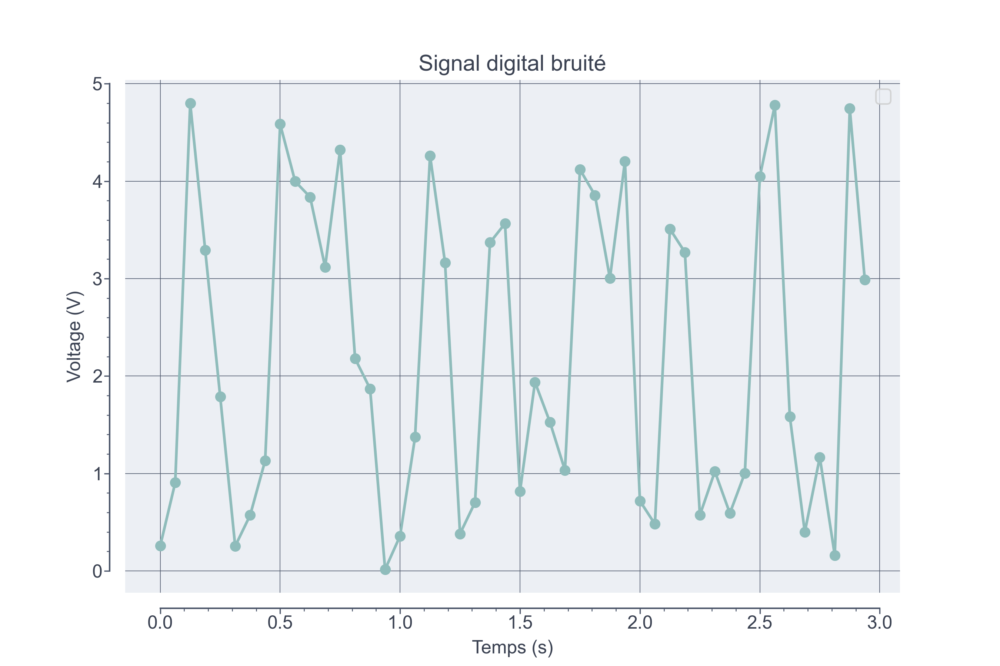

# Représentation des entiers

## La notation positionnelle

La **notation positionnelle** est un système d'écriture des nombres. Cette manière de représenter efficacement les nombres existe depuis le IIIe millénaire avant notre ère chez les babyloniens. Elle repose sur l'utilisation d'un nombre limité de symboles graphiques appelés **chiffres**. La **base** désigne le nombre de chiffres utilisés.

??? example "La base décimale"
    Par exemple, on écrit couramment les nombres en utilisant dix chiffres : 0, 1, 2, 3, 4, 5, 6, 7, 8, et 9. On utilise donc la base 10 aussi appelée base décimale.


??? example "Un autre example de base"
    La base 16 appelée base hexadécimale utilise seize chiffres : 0, 1, 2, 3, 4, 5, 6, 7, 8, 9, A, B, C, D, E et F. Il est courant d'utiliser les lettres de l'alphabet latin comme symboles graphiques pour représenter les chiffres après 9. 


??? note "« Les chiffres disent que... »"
    Dans le langage courant, les termes *chiffres* et *nombres* sont utilisés de manière interchangeable. Or, un nombre est composé de chiffres ! A noter que « 2 » par exemple peut désigner soit le chiffre ou soit le nombre…


Dans cette notation, un nombre est écrit comme une séquence ordonnée de chiffres. Chaque chiffre contribue à la valeur totale en fonction de sa **position**. Cette contribution est obtenue en multipliant le chiffre par la puissance appropriée de la base.

!!! example "Un exemple en base décimale"
    Chacun des chiffres du nombre 256, écrit en base décimale, ont une contribution différente :
    
    $$
    \begin{align}
    \textcolor{#71d4e2}{256} &= 200 + 50 + 6 \\
    &= 2 \times 100 + 5 \times 10 + 6 \times 1 \\
    &= \textcolor{#71d4e2}{2} \times \textcolor{#ff6188}{10}^\textcolor{#A5D6A7}{2}  +  \textcolor{#71d4e2}{5}\times \textcolor{#ff6188}{10}^\textcolor{#A5D6A7}{1}  + \textcolor{#71d4e2}{6} \times \textcolor{#ff6188}{10}^\textcolor{#A5D6A7}{0} 
    \end{align}
    $$

    Cette dernière ligne met en évidence la base utilisée. **Code couleur : <font color=#71d4e2>Chiffre</font>, <font color=#ff6188>Base</font>, <font color=#A5D6A7>Position</font>.**

!!! example "Un exemple en base octal"
    La base 8, appelée base octale, comporte seulement 8 chiffres : 0, 1, 2, 3, 4, 5, 6 et 7. Si l'on écrit le nombre $(256)_8$ dans cette base (indiquée en indice), alors par définition :
    
    $$
    (\textcolor{#71d4e2}{256})_\textcolor{#ff6188}{8} = \textcolor{#71d4e2}{2} \times \textcolor{#ff6188}{8}^\textcolor{#A5D6A7}{2}  +  \textcolor{#71d4e2}{5}\times \textcolor{#ff6188}{8}^\textcolor{#A5D6A7}{1}  + \textcolor{#71d4e2}{6} \times \textcolor{#ff6188}{8}^\textcolor{#A5D6A7}{0}
    $$

    Une fois le nombre décomposé, nous pouvons effectuer les calculs dans la base décimale usuelle :

    $$
    \begin{align}
    (256)_8 &= 2 \times 64 + 5 \times 8 + 6 \\
    &= 128 + 40 + 6 \\
    &= (174)_{10}
    \end{align}
    $$
    
    **C'est la méthode usuelle pour convertir un nombre écrit dans une base quelconque vers la base décimale usuelle.**

??? note "Une prononciation confuse"
    $(256)_8$ ne se prononce pas « *deux cents cinquante-six* » mais plutôt « *deux cinq six* » puisqu'à l'oral le nombre est décomposé en base décimale (par exemple, « *cents* » fait référence à une puissance de la base décimale).

??? question "Exercice 1"
    Convertir ces nombres en base décimale :

    1. $(256)_7$
    2. $(2222)_8$
    3. $(2AB)_{16}$
    4. $(100.12)_4$
    5. $(30200)_\sqrt{2}$

## Compter dans une base différente

Il est important de savoir énumérer les nombres dans une base différente. Si l'on a épuisé tous les chiffres disponibles, on augmente le chiffre du rang suivant :

|       Base 10 |           Base 2 |         Base 4 |       Base 16 |
| ------------: | ---------------: | -------------: | ------------: |
| $\texttt{ 0}$ |  $\texttt{   0}$ |   $\texttt{0}$ |  $\texttt{0}$ |
| $\texttt{ 1}$ |  $\texttt{   1}$ |   $\texttt{1}$ |  $\texttt{1}$ |
| $\texttt{ 2}$ |  $\texttt{  10}$ |   $\texttt{2}$ |  $\texttt{2}$ |
| $\texttt{ 3}$ |  $\texttt{  11}$ |   $\texttt{3}$ |  $\texttt{3}$ |
| $\texttt{ 4}$ |  $\texttt{ 100}$ |  $\texttt{10}$ |  $\texttt{4}$ |
| $\texttt{ 5}$ |  $\texttt{ 101}$ |  $\texttt{11}$ |  $\texttt{5}$ |
| $\texttt{ 6}$ |  $\texttt{ 110}$ |  $\texttt{12}$ |  $\texttt{6}$ |
| $\texttt{ 7}$ |  $\texttt{ 111}$ |  $\texttt{13}$ |  $\texttt{7}$ |
| $\texttt{ 8}$ |  $\texttt{1000}$ |  $\texttt{20}$ |  $\texttt{8}$ |
| $\texttt{ 9}$ |  $\texttt{1001}$ |  $\texttt{21}$ |  $\texttt{9}$ |
| $\texttt{10}$ |  $\texttt{1010}$ |  $\texttt{22}$ |  $\texttt{A}$ |
| $\texttt{11}$ |  $\texttt{1011}$ |  $\texttt{23}$ |  $\texttt{B}$ |
| $\texttt{12}$ |  $\texttt{1100}$ |  $\texttt{30}$ |  $\texttt{C}$ |
| $\texttt{13}$ |  $\texttt{1101}$ |  $\texttt{31}$ |  $\texttt{D}$ |
| $\texttt{14}$ |  $\texttt{1110}$ |  $\texttt{32}$ |  $\texttt{E}$ |
| $\texttt{15}$ |  $\texttt{1111}$ |  $\texttt{33}$ |  $\texttt{F}$ |
| $\texttt{16}$ | $\texttt{10000}$ | $\texttt{100}$ | $\texttt{10}$ |
| $\texttt{17}$ | $\texttt{10001}$ | $\texttt{101}$ | $\texttt{11}$ |

Sur cette table, par exemple, on lit directement $(12)_{10} = (1100)_2 = (30)_4 = (C)_{16}$.

??? question "Exercice 2"
    1. Ajouter à cette table la base ternaire, la base 3.
    2. Poursuivre l'énumération en base binaire (base 2) à partir de $(10001)_2$ jusqu'à $(11111)_2$.

??? question "Exercice 3"
    1. Quelle est la plus petite des bases possibles ?
    2. Dans quelle base avez-vous «18 » ans ?
    3. Que vaut $\pi$ dans la base $\pi$ ?
    4. Quelle est le plus grand nombre entre $(123456789)_{42}$ et $(123456789)_{27}$ ?
    5. Nous avons vu que si la base utilisée est plus grande que dix alors il est courant d'utiliser les lettres de l'alphabet comme symboles graphiques pour représenter les chiffres après 9. Mais il existe une autre manière de représenter ces « grandes » bases. Laquelle ? Tic tac...
    6. Lorsqu'on écrit $(256)_8$  — 256 en base octal — dans quelle base est écrit le nombre « $8$ » ? Mettre en évidence une incohérence dans ce système de notation.
    7. Comment s'écrire huit en base octale ? Et seize en base hexadécimale ? Peut-on dire que toutes les bases sont la base « 10 » ?

??? question "Exercice 4"
    Finalement, pourquoi la notation positionnelle est plus intéressante que la numération égyptienne ou romaine ?

## La base binaire

!!! note "Une histoire de bits"
    Un chiffre binaire (0 ou 1), en anglais *binary digit*, est appelé **bit**.

### Conversion base 2 :fontawesome-solid-arrow-right: base 10

!!! example "Exemple" 
    Convertissons $(10110011)_2$ en base décimale. On décompose :

    $$
    \begin{align*}
    (\textcolor{#71d4e2}{10110011})_\textcolor{#ff6188}{2} &=
    \textcolor{#71d4e2}{1} \times \textcolor{#ff6188}{2}^\textcolor{#A5D6A7}{7} +
    \textcolor{#71d4e2}{0} \times \textcolor{#ff6188}{2}^\textcolor{#A5D6A7}{6} +
    \textcolor{#71d4e2}{1} \times \textcolor{#ff6188}{2}^\textcolor{#A5D6A7}{5} +
    \textcolor{#71d4e2}{1} \times \textcolor{#ff6188}{2}^\textcolor{#A5D6A7}{4} +
    \textcolor{#71d4e2}{0} \times \textcolor{#ff6188}{2}^\textcolor{#A5D6A7}{3} +
    \textcolor{#71d4e2}{0} \times \textcolor{#ff6188}{2}^\textcolor{#A5D6A7}{2} +
    \textcolor{#71d4e2}{1} \times \textcolor{#ff6188}{2}^\textcolor{#A5D6A7}{1} +
    \textcolor{#71d4e2}{1} \times \textcolor{#ff6188}{2}^\textcolor{#A5D6A7}{0} \\
    &= \textcolor{#ff6188}{2}^\textcolor{#A5D6A7}{7} +
       \textcolor{#ff6188}{2}^\textcolor{#A5D6A7}{5} +
       \textcolor{#ff6188}{2}^\textcolor{#A5D6A7}{4} + 
       \textcolor{#ff6188}{2}^\textcolor{#A5D6A7}{1} + 
       \textcolor{#ff6188}{2}^\textcolor{#A5D6A7}{0} \\
    &= 128 + 32 + 16 + 2 + 1 \\
    &= (179)_{10}
    \end{align*}
    $$

    Finalement, un nombre binaire se décompose comme **une somme de puissances de 2** ! Il est donc courant d'écrire directement la 2ème ou 3ème équation.

??? question "Exercice 5"
    Compléter la table des puissances de 2 suivante : 

    | Puissance | Valeur |
    | :-------: | :----: |
    |   $2^0$   |  $1$   |
    |   $2^1$   |        |
    |   $2^2$   |        |
    |   $2^3$   |        |
    |   $2^4$   |        |
    |   $2^5$   |        |
    |   $2^6$   |        |
    |   $2^7$   |        |

??? question "Exercice 6"
    Convertir les nombres suivants en base décimale :

    * $(1010)_2$

    * $(101110)_2$

    * $(10001101)_2$

    * $(11111111)_2$

### Conversion base 10 :fontawesome-solid-arrow-right: base 2

Comment s'écrit $(181)_{10}$ en base binaire ? L'opération inverse est de trouver les bits qui vont bien dans la décomposition :

$$
(181)_{10} ~=~ \textcolor{#71d4e2}{?} \cdot 2^0 ~+~
\textcolor{#71d4e2}{?} \cdot 2^1 ~+~
\textcolor{#71d4e2}{?} \cdot 2^2 ~+~
\textcolor{#71d4e2}{?} \cdot 2^3 ~+~ \cdots
$$

Il existe deux méthodes itératives. Une méthode spécifique à la base binaire (la méthode des soustractions successives), et une dernière plus générale qui permet de convertir vers une base quelconque (la méthode des divisions successives).


#### La méthode des soustractions successives

Cette méthode repose sur la remarque suivante : s'il on arrive à exprimer un nombre sous la forme d'**une somme de puissance de 2** alors il est facile de l'écrire en base binaire. Par exemple :

$$
\begin{align*}
(179)_{10} &= 128 + 32 + 16 + 2 + 1 \\
           &= 2^7 + 2^5 + 2^4 + 2^1 + 2^0 \\
           &= (10110011)_2
\end{align*}
$$

!!! tip "Méthode des soustractions successives"
    On soustrait du nombre la plus grande puissance de 2 possible, et on recommence jusqu'à obtenir 0 :
    
    $$
    \begin{align*}
    &181 && \textcolor{#ff6188}{- 128} &&= 53 \\
    &53  && \textcolor{#ff6188}{- 32 } &&= 21   \\
    &21  && \textcolor{#ff6188}{- 16 } &&= 5    \\
    &5   && \textcolor{#ff6188}{- 4  } &&= 1      \\
    &1   && \textcolor{#ff6188}{- 1  } &&= 0      \\
    \end{align*}
    $$

    Finalement :

    $$\begin{align*}
    (181)_{10} &= \textcolor{#ff6188}{128 + 32 + 16 + 4 + 1} \\
    &= 2^7 + 2^5 + 2^4 + 2^2 + 2^0 \\
    &= (10110101)_2
    \end{align*}
    $$

    Cette méthode nécessite impérativement de connaître les puissances de 2. Avec un peu de pratique, il est possible de directement écrire la somme des puissances de 2.

??? question "Exercice 7"
    Convertir les nombres en base décimal suivant en base binaire :

    1. 17
    2. 34
    3. 68
    4. 100
    5. 200

    Que remarquez-vous dans l'écriture binaire quand on passe d'un nombre à son double ?

#### La méthodes des divisions successives 

!!! tip "Méthode des divisions successives"

    On divise le nombre par la base souhaitée, et on recommence jusqu'à obtenir un quotient de 0. L'écriture du nombre dans la base souhaitée est alors donnée par **les restes lus de bas en haut**.

    {  width="300px", align=center }


??? note "C'est magique ?"
    Pour se convaincre de la méthode, regardons ce que l'on fait mathématiquement sur un exemple. Convertissons 19 en binaire. Rappelons qu'une division revient à écrire :
    
    $$
    \text{dividende} = \text{quotient} \times \textcolor{#71d4e2}{\text{diviseur}} + \textcolor{#ff6188}{\text{reste}}
    $$
    
    Ainsi :

    $$
    19 = 9 \cdot \textcolor{#71d4e2}{2} + \textcolor{#ff6188}{1}
    $$

    On poursuit l'algorithme :

    $$
    \begin{align*}
    19 &= (4 \cdot \textcolor{#71d4e2}{2} + \textcolor{#ff6188}{1}) \cdot \textcolor{#71d4e2}{2} + \textcolor{#ff6188}{1} \\
    &= ((2 \cdot \textcolor{#71d4e2}{2} + \textcolor{#ff6188}{0}) \cdot \textcolor{#71d4e2}{2} + \textcolor{#ff6188}{1}) \cdot \textcolor{#71d4e2}{2} + \textcolor{#ff6188}{1} \\
    &= (((\textcolor{#ff6188}{1} \cdot \textcolor{#71d4e2}{2} + \textcolor{#ff6188}{0}) \cdot \textcolor{#71d4e2}{2} + \textcolor{#ff6188}{0}) \cdot \textcolor{#71d4e2}{2} + \textcolor{#ff6188}{1}) \cdot \textcolor{#71d4e2}{2} + \textcolor{#ff6188}{1}
    \end{align*}
    $$

    Ensuite, on distribue les 2 pour faire apparaître nos puissances :

    $$
    \begin{align*}
    19 &= \textcolor{#ff6188}{1} \cdot \textcolor{#71d4e2}{2^4} + 
    \textcolor{#ff6188}{0} \cdot \textcolor{#71d4e2}{2^3} +
    \textcolor{#ff6188}{0} \cdot \textcolor{#71d4e2}{2^2} +
    \textcolor{#ff6188}{1} \cdot \textcolor{#71d4e2}{2} +
    \textcolor{#ff6188}{1} \\
    &= (\textcolor{#ff6188}{10011})_2
    \end{align*}
    $$

    Ici, on voit bien que le premier reste correspond bien au premier bit (celui tout à droite, qu'on appelle le **bit de poids faible**).


!!! note "Définition"
    Le **bit de poids fort** (respectivement de **poids faible**) est le bit ayant le plus grand (resp. petit) poids ou position, c'est-à-dire celui tout à gauche (resp. droite).

??? question "Exercice 8"
    Convertir les nombres décimaux suivant vers la base mentionnée grâce à l'algorithme des divisions successives. 

    * 231 en base 2

    * 47 en base 5

    * 92 en base 4


### Différence entre mot et nombre binaire

!!! note "Définition"

    * Un **mot binaire** est une séquence finie de bits. Par exemple, $\texttt{1001}$ est un mot binaire de 4 bits.

    * Un **octet** (ou *byte* en anglais) est un **mot binaire** de 8 bits. Par exemple, $\texttt{10111010}$ est un octet.


La signification d'un mot binaire en machine dépend entièrement de son **interprétation**. Interprété différemment, le mot binaire $\texttt{10110011}$ peut  signifier :

* naturellement le nombre binaire $(10110011)_2 = 179$ 
*  $-77$ suivant la représentation classique des nombres relatifs
*  $44.75$ en supposant une virgule fixe de 2 bits
*  le caractère « ³ » d'après la table ASCII étendue
*  etc.


### Importance de la base binaire dans l'informatique

La base binaire est au cœur de toutes les machines, car toute donnée (nombre, texte, image, vidéo, son etc.) peut être arbitrairement représentée par une suite de 0 et de 1. Les machines se basent sur différents phénomènes physiques pour manipuler, transmettre ou mémoriser ces deux états possibles :

* :fontawesome-solid-bolt: Courant électrique : Tension nulle ou tension positive.

* :fontawesome-solid-magnet: Aimantation : Aimantation dans un sens ou dans l'autre.

* :fontawesome-solid-lightbulb: Lumière : Lumière ou absence de lumière.

* etc.

La base binaire est utilisée pour trois grandes raisons :

* **Résistance au bruit** : il est plus facile de distinguer deux valeurs dans un signal digital bruité.
  
* **Simplicité des opérations** : la simplicité des opérations arithmétiques (addition, soustraction etc.) et logiques en base binaire permet l'élaboration de circuits électroniques moins complexes. 

* **Inertie technologique** : revenir en arrière aurait un coût immense.

??? question "Exercice 9"
    
    1. Donner les bits transmis par le signal fortement bruité suivant. Le débit (*bitrate* en anglais) est d'un octet par seconde. Idéalement, 0V correspond à 0 et 5V à 1. 

        { align=center }

    2. Le code ASCII associe à chaque **mot binaire** d'un octet, un caractère spécifique (comme une lettre). En utilisant la [table de correspondance](https://fr.wikipedia.org/wiki/American_Standard_Code_for_Information_Interchange#Table_des_128_caract%C3%A8res_ASCII), donner le message transmis par ce signal.

    3. En base binaire, que vaut $0 + 0$ ? $0 + 1$ ? $1 + 1$ ? $1 + 1 + 1$ ?

    4. Calculer directement $(110110)_2 + (110100)_2$ en posant l'addition.

    5. Dresser la table de multiplication de la base binaire.

    6. Calculer directement $(110110)_2 \times (11)_2$ en posant la multiplication.
   
??? question "Exercice 10"
    1. Combien de valeurs (mots binaires uniques) peut-on distinguer avec 1 bit ? 2 bits ? 3 bits ? 4 bits ? 5 bits ?
    2. Plus généralement, combien de valeurs peut-on distinguer avec $n$ bits ?
    3. Jusqu'à combien peut-on compter avec nos deux mains en base binaire ?
    1. Combien de caractères uniques puis-je représenter en code ASCII ?
    2. Quel est le plus grand entier positif que l'on puisse représenter sur un octet ? En utilisant une représentation naturelle des nombres entiers, c'est-à-dire que l'octet $\texttt{11111111}$ est égal au nombre $(11111111)_2$.

### Relation avec la base hexadécimale (base 16)

La base **hexadécimale** (hexa 6, déci 10) est la base utilisant 16 chiffres notés 0, 1, 2, ..., 9, A, B, C, D, E, F.

Lire ou écrire en binaire devient vite fastidieux. C'est pourquoi la base hexadécimale est très utile en informatique puisque **la conversion entre cette base et la base binaire se fait sans calcul** (du fait que $16 = 2^4$). On regroupe les bits par paquet de 4 et on effectue la correspondance grâce au tableau suivant :

|       Base 10 |           Base 2 |       Base 16 |
| ------------: | ---------------: | ------------: |
| $\texttt{ 0}$ |  $\texttt{   0}$ |  $\texttt{0}$ |
| $\texttt{ 1}$ |  $\texttt{   1}$ |  $\texttt{1}$ |
| $\texttt{ 2}$ |  $\texttt{  10}$ |  $\texttt{2}$ |
| $\texttt{ 3}$ |  $\texttt{  11}$ |  $\texttt{3}$ |
| $\texttt{ 4}$ |  $\texttt{ 100}$ |  $\texttt{4}$ |
| $\texttt{ 5}$ |  $\texttt{ 101}$ |  $\texttt{5}$ |
| $\texttt{ 6}$ |  $\texttt{ 110}$ |  $\texttt{6}$ |
| $\texttt{ 7}$ |  $\texttt{ 111}$ |  $\texttt{7}$ |
| $\texttt{ 8}$ |  $\texttt{1000}$ |  $\texttt{8}$ |
| $\texttt{ 9}$ |  $\texttt{1001}$ |  $\texttt{9}$ |
| $\texttt{10}$ |  $\texttt{1010}$ |  $\texttt{A}$ |
| $\texttt{11}$ |  $\texttt{1011}$ |  $\texttt{B}$ |
| $\texttt{12}$ |  $\texttt{1100}$ |  $\texttt{C}$ |
| $\texttt{13}$ |  $\texttt{1101}$ |  $\texttt{D}$ |
| $\texttt{14}$ |  $\texttt{1110}$ |  $\texttt{E}$ |
| $\texttt{15}$ |  $\texttt{1111}$ |  $\texttt{F}$ |


!!! example "Exemple de conversion immédiate"
    Le nombre $(10110011)_2$ est composé de 2 groupes de 4 bits, $1011$ et $0011$. On lit sur le tableau que $(1011)_2 = (B)_{16}$ et $(0011)_2 = (3)_{16}$ :

    $$
    (10110011)_2 = (B3)_{16}
    $$

    Le raisonnement inverse est tout aussi immédiat.


??? question "Exercice 11"
    1. Convertir $(110111)_2$ en hexadécimal.

    2. Convertir $(1011110100111)_2$ en hexadécimal.

    3. Convertir $(CAFE)_{16}$ en binaire.

    4. Convertir $(C1)_{16}$ en binaire.
   
    5. Combien de chiffres en base hexadécimal sont nécessaires pour écrire un octet ?


## Quelques fonctions Python utiles

!!! note "Notation"
    Dans la plupart des langages de programmation, on différencie :

    * La base binaire par le préfixe `0b` (e.g. `variable = 0b10110011`).

    * La base hexadécimale par le préfixe `0x` (e.g. `variable = 0xD3`).

    * La base décimale par aucun préfixe particulier.


La fonction `bin` (respectivement `hex`) renvoie la représentation binaire (resp. héxadécimale) d'un nombre donné sous forme d'une chaîne de caractère :

``` py
>>> bin(42)
'0b101010'
>>> hex(42)
'0x2a'
```

Réciproquement, on utilise la fonction `int` pour convertir un nombre écrit en base quelconque donnée (par défaut 10) dans une chaîne de caractère donnée :

``` py
>>> int('0xCAFE', 16)
51966
>>> int('0b111100001111', 2)
3855
```
