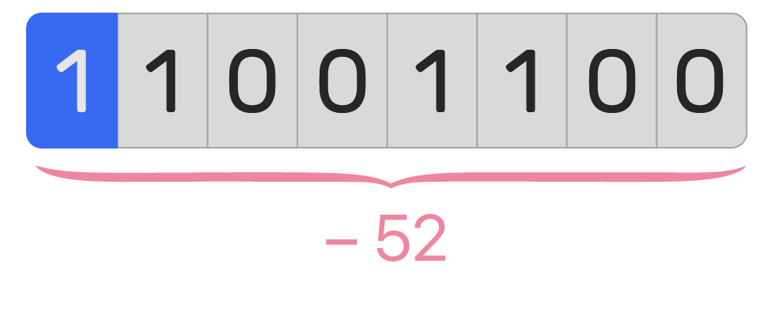

# Représentation des entiers relatifs

Comme vu précédemment, une machine ne peut stocker ou manipuler que des 0 et des 1 sous la forme de mots binaires. Une question se pose alors, comment la machine représente les entiers négatifs puisque le signe « moins » n'est pas disponible ?

## Représentation naïve

Une première idée serait de réserver, sur un mot binaire de taille fixée, un bit pour distinguer les nombres positifs des nombres négatifs, c'est le **bit de signe**. Le reste des bits représentera alors la valeur absolue du nombre.

<figure markdown>
{ width=400px }
<figcaption>Représentation naïve de -52 sur un octet.</figcaption>
</figure>

!!! note "Le bit de signe"
    Deux choix intéressants sur le bit de signe :

    * Le bit de signe vaut $\texttt{0}$ si le nombre est positif, $\texttt{1}$ si négatif.

    * Le bit de signe se situe sur le bit de poids fort.

    De cette manière, si le nombre est positif, il aura la même représentation binaire que les entiers positifs.

??? question "Exercice 1 - Inconvénients de la représentation naïve"
    1. Dresser un tableau qui met en correspondance les mots binaires de 4 bits avec les nombres relatifs correspondants suivant la représentation naïve des relatifs. Cette représentation est-elle efficiente ?

    2. L'addition binaire fonctionne-t-elle suivant cette représentation ?

## Représentation par le complément à 2

Pour remédier aux problèmes posés par une représentation naïve, John von Neumann a introduit en 1945 une méthode plus efficace pour représenter les nombres relatifs, la représentation par le **complément à deux**. Dans cette représentation :

* Un nombre positif est représenté de manière usuelle (comme la représentation naïve, bit de signe inclus).

* Un nombre négatif est représenté suivant la méthode du complément à 2, c'est-à-dire les opérations successives :
    * Coder en binaire sa valeur absolue sur un nombre fixé de bits
    * Inverser tous les bits
    * Ajouter 1 (les dépassements sont ignorés)


??? example "Exemple de la représentation par le complément à 2"
    Déterminons le complément à 2 de $-42$ sur un octet :
    
    * Coder en binaire sa valeur absolue sur un octet : $(42)_{10} = (101010)_2$, on obtient le mot binaire $\texttt{00101010}$
    * Inverser tous les bits : $\texttt{11010101}$
    * Ajouter 1 : $\texttt{11010110}$

    Ainsi, $-42$ est représenté par le mot binaire $\texttt{11010110}$.

??? question "Exercice 2"
    Donner la représentation binaire (complément à 2) des nombres sur un octet :
    
    * 56
    * -24
    * 27
    * -89


<figure markdown>
{ width=400px }
<figcaption>Représentation par le complément à 2 de -52 sur un octet.</figcaption>
</figure>

Pour déterminer l'entier à partir de sa représentation binaire :

* Si le bit de signe vaut $\texttt{0}$ alors l'entier est positif, donc on le convertit en base décimale directement.

* Sinon le bit de signe vaut $\texttt{1}$ alors l'entier est négatif, on applique alors la méthode **inverse** du complément à 2 :
    * Soustraire 1
    * Inverser tous les bits
    * Le mot binaire obtenu correspond à la valeur absolue du nombre

??? question "Exercice 3"  
    Quels sont les entiers relatifs dont la représentation binaire (complément à 2) est :

    * $\texttt{01100111}$
    * $\texttt{10011001}$ 

??? question "Exercice 4 - Intérêt de cette nouvelle représentation"  
    1. Faites l’addition binaire de des deux représentations binaires de 56 et −24. Le résultat est-il correct dans cette nouvelle représentation ?

    2. Faites l’addition binaire de ces deux représentations binaires de 27 et −89. Convertissez le résultat en base décimale et vérifiez le calcul.


??? question "Exercice 5 - Visualisation"
    1. Dresser un tableau qui met en correspondance les mots binaires de 4 bits avec les nombres relatifs correspondants suivant la représentation par le complément à 2 des relatifs.

    2. Sur la droite des entiers relatifs, y inscrire leur représentation binaire (complément à 2).

??? question "Exercice 6 - Intervalle"
    Donner l'intervalle des nombres entiers relatifs que l'on peut représenter sur :

    * 2 bits
    * 4 bits
    * 8 bits
    * 16 bits
    * $n$ bits


## En programmation

### Types d'entiers signés et non-signés

La plupart des langages de programmation offrent souvent 4 types d'entiers codés sur 8, 16, 32 ou 64 bits (1, 2, 4 ou 8 octets) que l'on peut définir comme signé ou non suivant l'utilisation souhaitée. Par exemple en Julia, on peut déclarer une variable de type `UInt32` ou `Int32` (U pour Unsigned, non-signé).


### Overflow

Comme expliqué précédemment, il est possible de coder uniquement un nombre limité d'entiers en fonction de la longueur du mot binaire. Par exemple dans le cas non-signé, un octet peut représenter un entier positif entre 0 et 255. Tout calcul dont le résultat ne fait pas partie de cet intervalle donnera un résultat faux, il sera tronqué ! On parle de dépassement de capacité, ou overflow en anglais.

```pycon
>>> import numpy as np
>>> np.uint8(250) + np.uint8(10)
<stdin>:1: RuntimeWarning: overflow encountered in scalar add
4
```

En python, le type `#!py int` est un peu particulier car il utilise un nombre variable de bits pour stocker un entier, il n'y a donc aucun soucis à se faire. Pour s'en convaincre, il suffit d'essayer de calculer une très grosse puissance.

