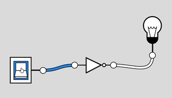

# Les booléens

## Un peu d'histoire

**George Boole** (1815-1864) était un mathématicien et logicien britannique célèbre pour avoir développé la logique moderne, oui plus précisément l'**algèbre de Boole**. Cette algèbre comprend seulement deux valeurs : **Vrai** et **Faux**. Elle trouve de nombreuses et significatives applications dans le domaine de l'informatique (typiquement le type `#!py bool`).

??? note "Qu'est-ce qu'une algèbre ?"
    En mathématiques, une algèbre se compose d'un **ensemble d'éléments** et d'**opérations** définies sur ces éléments (et quelques autres propriétés que nous passons sous silence). Typiquement l'algèbre sur les réels utilise les éléments de $\mathbb{R}$ avec les opérations arithmétiques classiques $+$, $\times$. L'algèbre booléenne utilise les deux éléments $\{ \texttt{Vrai}, \texttt{Faux} \}$ et les trois opérateurs logiques $\texttt{et}$, $\texttt{ou}$ et $\texttt{non}$.

## Introduction

En logique, une **proposition** est une phrase qui est soit **vraie**, soit **fausse**. Par exemple, la proposition « $1 + 1 = 42$ » est fausse, tandis que la proposition « $2 + 2 = 4$ » est vraie.

??? note "Les deux principes de la logique"
    * Principe du de **non-contradiction**  : une proposition ne peut pas être vraie et fausse à la fois.
    * Principe du **tiers-exclu** : ou bien une proposition est vraie, ou bien sa négation est vraie.

??? question "Question 1"
    Pour chacune de ces phrases, indiquer si elle est une proposition ou non : si tel est le cas, indiquer si elle est vraie ou fausse.

    1. Vous êtes en classe de première

    2. Antoine de Saint-Exupéry a écrit *Le Petit Prince*

    3. Le ciel est magnifique ce soir
 
    4. $3 \cdot 4 = 12$

    5. La lettre `#!python 'e'` est dans le mot `#!python 'abracadabra'`

    6. $2^{10} < 10^3$

    7. La couleur orange est la plus belle des couleurs

    8. $x + 3 = y$

    9. Taisez-vous !


## l'algèbre de Boole

### Les booléens

L'algèbre de Boole consiste à étudier des opérations sur un ensemble uniquement constitué de deux éléments qu'on appelle **booléens**. Selon le contexte, ces deux éléments sont notés :

* $\texttt{Vrai}$ et $\texttt{Faux}$

* 0 et 1

*  `#!py False` et `#!py True` en Python

* etc.

??? note "Les valeurs booléennes en Python"

    On rappelle qu'il existe un type booléen en Python, le type `#!python bool`. Une variable de ce type ne peut prendre que deux valeurs, soit `#!python False` soit `#!python True`.

    ``` py
    >>> type(True)
    <class 'bool'>
    >>> x = False
    >>> x
    False
    >>> type(x)
    <class 'bool'>
    ```

    En Python, les valeurs booléennes apparaissent notamment lorsqu'on utilise les opérateurs de comparaison (`#!py ==`, `#!py <`, `#!py <=` etc.) :

    ```py
    >>> a = 2
    >>> a == 3
    False
    >>> a == 2
    True
    >>> a != 1
    True
    >>> a > 2
    False
    >>> a <= 5
    True
    >>> a % 2 == 0
    True
    >>> x = (0 == 1)
    >>> x
    False
    >>> y = (3 + 2 == 5)
    >>> y
    True
    >>> 'e' in 'abracadabra'
    False
    >>> 'b' in 'abracadabra'
    True
    >>> 'A' not in 'abracadabra'
    True
    >>> 42 in [10, 20, 30, 40, 42]
    True
    ```


??? question "Question 2"
    1. Dans l'exemple précédent, que fait l'opérateur d'appartenance `#!py in` en Python ?

    2. Prédire, sans utiliser Python, le contenu des variables suivantes :
    
        ```py
        a = (2 > 1)
        b = (3 == 1 + 2)
        c = (1 < 0)
        d = (2 != 5/2)
        e = (2 != 5//2)
        f = ('a' == 'A')
        ```


### Les opérateurs logiques

Les opérations fondamentales sur ces deux valeurs sont définies par les **opérateurs logiques**. En posant $x$ et $y$ deux booléens, on a les opérations suivantes :

* La **négation**, que l'on note $\bar{x}$, ou plus simplement $\texttt{non } x$, `#!python not x` en Python.

* La **conjonction**, que l'on note $x \cdot  y$, ou plus simplement $x \texttt{ et } y$, `#!python x and y` en Python.

* La **disjonction**, que l'on note $x + y$, ou plus simplement $x \texttt{ ou } y$, `#!python x or y` en Python.

Le résultat de ces opérateurs entre booléens est encore un booléen. On peut tester l'opérateur $\texttt{et}$ en Python :

```py
>>> False and False
False
>>> False and True
False
>>> True and False
False
>>> True and True
True
```

On peut alors dresser une **table de vérité** pour définir complètement cet opérateur :

<center>

| $x$ | $y$ | $x \cdot y$ |
| :-: | :-: | :---------: |
|  0  |  0  |      0      |
|  0  |  1  |      0      |
|  1  |  0  |      0      |
|  1  |  1  |      1      |

</center>

Pour des raisons de praticité, on écrit 0 pour signifier $\texttt{Faux}$ et 1 pour $\texttt{Vrai}$.

À gauche se trouve toutes les entrées $x$ et $y$ possibles (on compte en binaire finalement), et à droite se trouve le résultat $x \cdot y$.

??? question "Question 3"
    1. Grâce à Python, dresser les tables de vérité des deux autres opérateurs.

    2. Pourquoi utilise-t-on la symbole $\cdot$ pour l'opérateur $\texttt{et}$ et le symbole $+$ pour l'opérateur $\texttt{ou}$ ?

### Les expressions booléennes

On peut s'amuser alors à écrire des expressions booléennes plus complexes avec ces trois opérateurs de base. Par exemple, soient $x$, $y$ et $z$ trois booléens :

$$
    f(a, b, c) = (a \cdot b) + (a \cdot c) 
$$

Par exemple, $f(1, 0, 1) = (1 \cdot 0) + (1 \cdot 1) = 0 + 1 = 1$.

??? question "Question 4"
    Dresser la table de vérité de $(x \cdot y) + z$ où $x$, $y$ et $z$ sont trois booléens.


??? question "Question 5"
    1. Dresser la table de vérité pour chacune de ces expressions booléennes :
    
        * $(a \cdot b) + (a \cdot c)$
    
        * $a \cdot (b + c)$
    
        Que peut-on dire sur ces deux expressions ?

    2. Faire de même avec les deux expressions suivantes :
    
        * $a + (\overline{a} \cdot b)$
    
        * $a + b$ 
    
        Que peut-on dire sur ces deux expressions ?

    3. Simplifier alors l'expression booléenne $(a \cdot b) + (a \cdot \overline{b} \cdot c)$ avec les résultats des questions précédentes.


??? question "Question 6"

    À l'aide de tables de vérité, démontrer **les lois de De Morgan** :

    * $\overline{x + y} = \overline{x} \cdot \overline{y}$

    * $\overline{x \cdot y} = \overline{x} + \overline{y}$

??? question "Question 7"
    Un autre opérateur logique important est le **ou exclusif**, ou **disjonction exclusive**. C'est le sens du mot « ou » dans le langage commun. Quand on vous demande « Fromage **ou** dessert ? », c'est soit l'un, soit l'autre. Pas les deux. Sauf pour les gourmands. On note l'opérateur $\oplus$, ou `xor`. En Python, il se note `^`. Voici sa table de vérité :

    <center>

    | $x$ | $y$ | $x \oplus y$ |
    | :-: | :-: | :----------: |
    |  0  |  0  |      0       |
    |  0  |  1  |      1       |
    |  1  |  0  |      1       |
    |  1  |  1  |      0       |

    </center>

    1. Qu'est-ce qui change par rapport à la table de vérité du $\texttt{ou}$ logique ?

    2. Écrire $x \oplus y$ en fonctions des trois opérateurs logiques de base.

## Mini-projet : additionneur binaire en portes logiques

L'invention du transistor dans les années 60 a permis de réaliser des circuits électroniques qui suivent l'algèbre de Boole, ce sont les **portes logiques**. Pour les trois opérations de base, nous en avons donc trois portes logiques :

=== "Circuit simple"
    <figure markdown>
    
    </figure>

=== "Porte NON"
    <figure markdown>
    
    </figure>

=== "Porte ET"
    <figure markdown>
    
    </figure>

=== "Porte OU"
    <figure markdown>
    
    </figure>

On se propose de réaliser un circuit composé de portes logiques pour additionner deux nombres binaires de trois bits (un nombre sera donc représenté par 3 interrupteurs). Un tel circuit se trouve au sein du processeur.

!!! note "S'amuser avec les portes logiques"
    Le site [Logic.ly](https://logic.ly/demo/) permet de tester justement toutes ces portes logiques et créer de petits circuits logiques !


??? question "Question 8"
    1. Dresser la table de vérité de l'addition entre deux bits. Il y a deux sorties : le résultat et la retenue.

    2. Schématiser cette table sous forme d'un circuit logique à deux entrées.

    3. On veut additionner deux bits et un bit de retenue, dresser la table de vérité à trois entrées et deux sorties (bit de résulat et retenue).

    4. Schématiser cette table sous forme d'un circuit logique à trois entrées.

    5. Vous avez maintenant les blocs de base pour créer un additionneur binaire entre deux nombres de 3 bits (ou plus avec quelques copier-coller). Réaliser le circuit sur [Logic.ly](https://logic.ly/demo/) et m'appeler.
