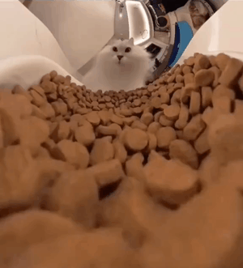

# Accueil
<!-- 
Cours, exercices et autres ressources pour mes élèves de 1ère en spécialité NSI au lycée Émile Combes à Pons.

!!! quote "Edsger W. Dijkstra "
    Computer Science is no more about computers than astronomy is about telescopes. -->


<!--  -->


<video width="320" height="240" autoplay loop muted style="border-radius: 10px; display: block; margin: 0 auto;">
  <source src="ressources/pons.webm">
</video> 


!!! warning "Travaux en cours"
    * Algorithmique :fontawesome-solid-play: L'algorithme KNN :fontawesome-solid-play: TP Capytale
    * Architecture :fontawesome-solid-play: Architecture réseau 

<!-- !!! warning "Travaux en cours"
    Contrôle sur le modèle d'architecture de Von Neumann (relire le cours et les compléments) le lundi 25 Mars ! 

    * TP Shell (section Architecture)
    * TP Recherche Dichotomique (section Algorithmique)
    * TP Complexité (section Algorithmique) -->


<!-- !!! warning "Travaux en cours"
    À finir pour la rentrée :

    * [TP Pokédex sur les tables](/3%20–%20Tables%20de%20données/4tp) : Le document réponse Capytal est enfin disponible ! Le fichier `pokedex.csv` est directement inclus !
    * [Algorithmes de tri](/7%20–%20Algorithmique/1tri) : Finir le TP Capytale (certaines questions seront abordées plus tard) -->


## Liens utiles
* [Programme en vigueur de spécialité NSI de 1ère générale](https://eduscol.education.fr/document/30007/download)

<!-- ``` py hl_lines="2 3" linenums="1"
import tensorflow as tf

def coucou(a):
    pass
```

=== "C"

    ``` c
    #include <stdio.h>

    int main(void) {
      printf("Hello world!\n");
      return 0;
    }
    ```

=== "C++"

    ``` c++
    #include <iostream>

    int main(void) {
      std::cout << "Hello world!" << std::endl;
      return 0;
    }
    ```

Et pourquoi pas inline `#!python import tensorflow as tf`. :warning:

$$
\operatorname{ker} f=\{g\in G:f(g)=e_{H}\}{\mbox{.}}
$$ -->